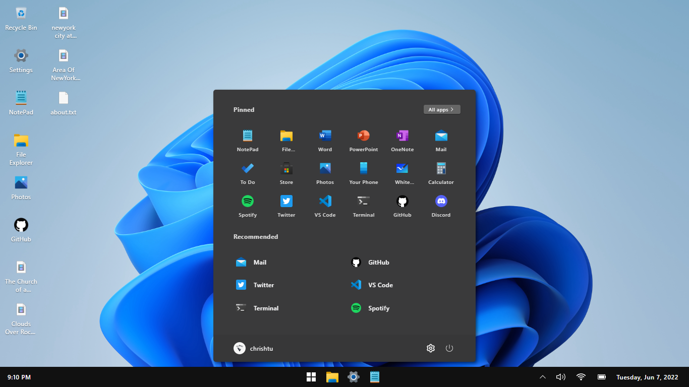
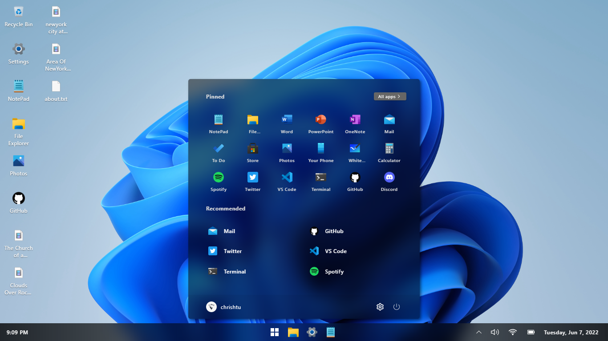
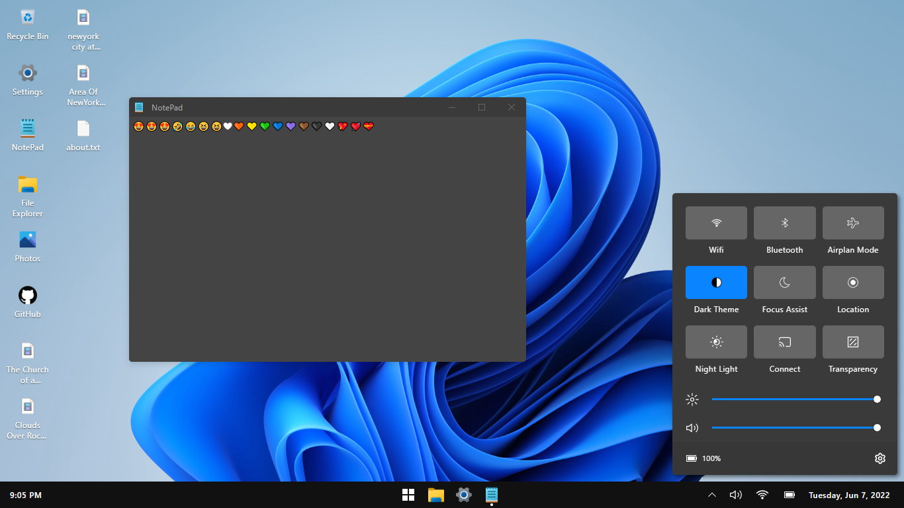
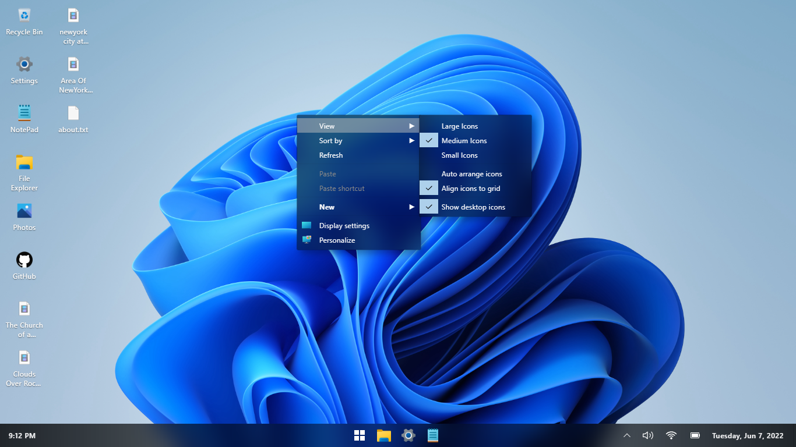

# Introduction

 - Experience Windows 11 UI on browser
 - Just using DOM API with TypeScript and CSS
 - Chrome or Chromium with lastest version is totaly recommended
 
## Start Menu

> Light Theme

> Dark Theme

## In App UI

## Action Center

## ContextMenu

## Night light

## Snap

# Known issues

 - **Blur not working** 
 - **Scrollbar UI incorrect as expect**
 
 How to resolve

> Run this project on Chrome
