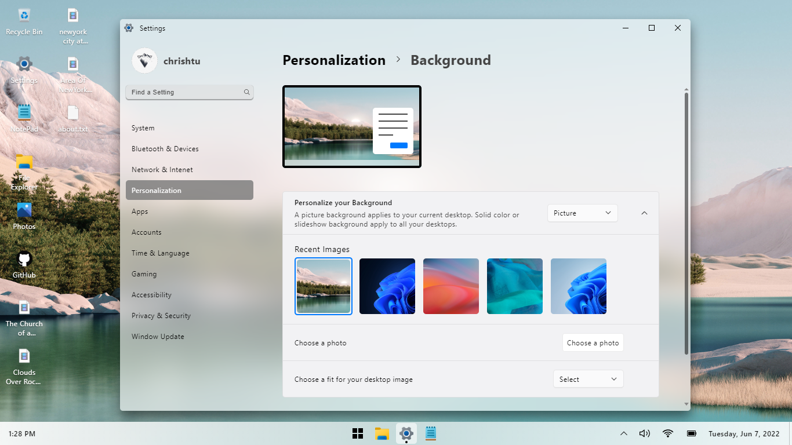

# Experence Windows 11 UI on web
This project is made to show Windows 11 UI on web and not Microsoft’s Operating System

**Live demo** [W11 UI](https://chrishtu.github.io/windows11)

## Features
- Personalization (Themes, Background, Color,...)
- Window Tabs (File Explorer, Notepad)
- Interact with files (Drag files or folders from "Local Device" to this app [Desktop Screen, File Explorer Pannel])

## Tech
- [Typescript](https://www.typescriptlang.org) - JavaScript With Syntax For Types
- HTML
- CSS

## Disclamer
Please don't save or provide any sensitive infomation into this app

## Troubleshoot

| Plobblem | Solution |
| ------ | ------ |
| This app take large amount of disk space | Delete all large file in the app or go to Settings app and navigate to System/Recovery then click "Reset" button
| Blur not working | Upgrade or switch to difference mordern web browser |

## Credits
Photos & Videos
- [Unsplash](https://unsplash.com)
- [Pexels](https://www.pexels.com)

## License
MIT
